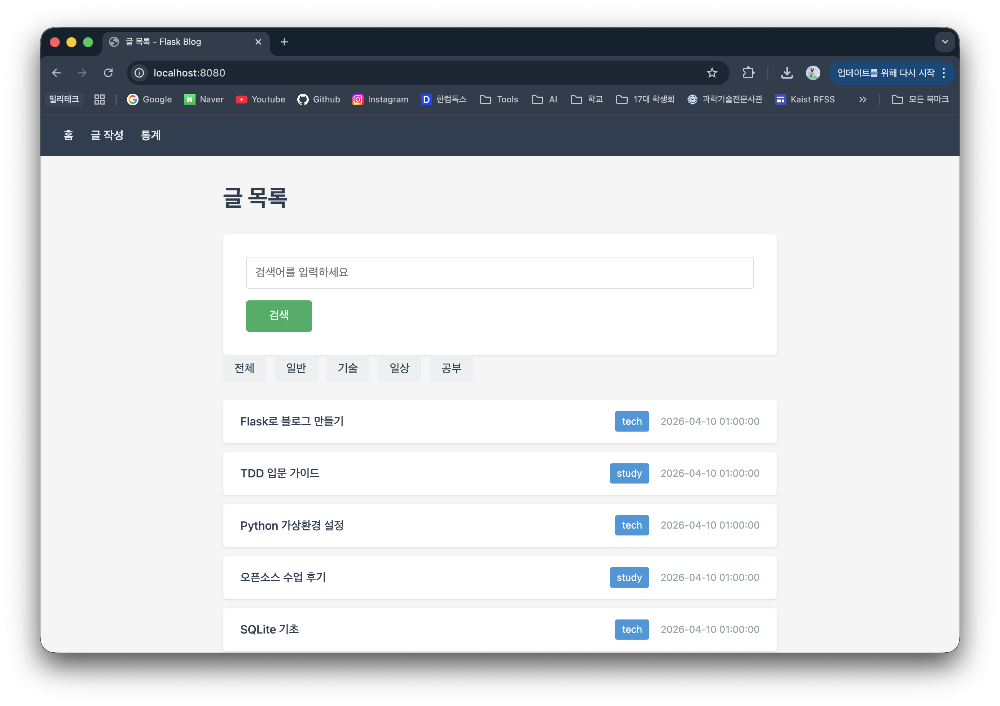
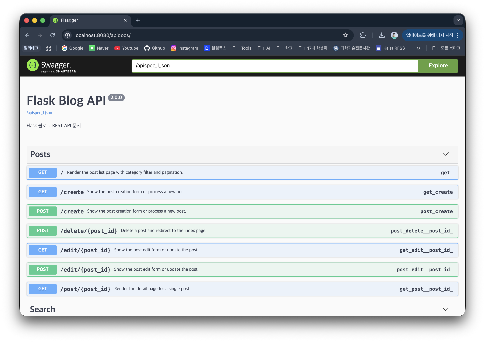
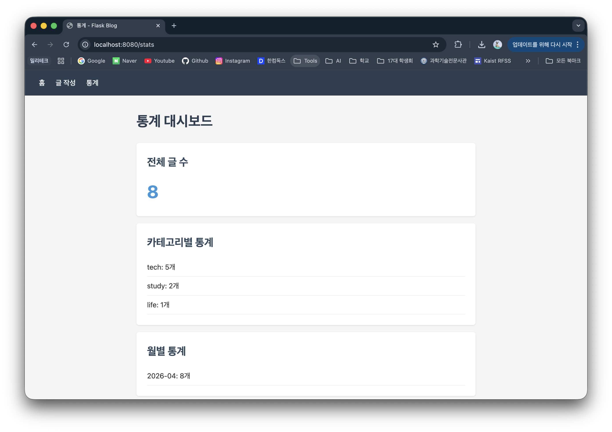

# Flask Blog

> TDD로 만든 SQLite 기반 Flask 블로그 — CRUD, 검색, 페이지네이션, 통계 대시보드를 지원합니다.

## 화면 미리보기

| 글 목록 | Swagger UI | 통계 대시보드 |
|---------|-----------|-------------|
|  |  |  |

## 프로젝트 동기

블로그는 백엔드 학습의 가장 적합한 프로젝트입니다. 단순해 보이지만 CRUD, 검색, 페이지네이션, 통계 등 실제 서비스에서 필요한 패턴을 모두 담고 있습니다. 이 프로젝트는 **TDD(Test-Driven Development)** 를 처음 적용해보면서 "테스트를 먼저 작성하는 것이 실제로 설계를 더 좋게 만드는가"라는 질문에 직접 답해보기 위해 시작했습니다.

## 기술 스택

| 기술 | 선택 이유 |
|------|-----------|
| **Python / Flask** | 미니멀한 구조로 HTTP 요청 흐름을 직접 학습 |
| **SQLite** | 설치 없이 파일 하나로 관계형 DB 개념 실습 |
| **pytest** | 픽스처와 파라미터화 테스트로 TDD 사이클 구현 |
| **Sphinx + autodoc** | docstring에서 HTML 문서를 자동 생성 |
| **Flasgger** | 라우트 docstring에 OpenAPI 스펙을 인라인으로 작성, Swagger UI 제공 |
| **GitHub Actions** | 테스트 · 린팅 · 도커 빌드 · 문서 배포를 완전 자동화 |
| **Docker / GHCR** | 환경 독립적인 이미지로 어디서든 동일하게 실행 |

## 주요 기능

- 글 CRUD (제목 / 내용 / 카테고리 관리)
- 카테고리 필터링 및 키워드 검색
- 5개 단위 페이지네이션
- 빈 제목/내용 서버사이드 검증 + 에러 메시지
- 통계 대시보드 (전체 · 카테고리별 · 월별 글 수)
- Swagger UI (`/apidocs`) — 브라우저에서 API 직접 테스트
- Sphinx 자동 API 문서 ([GitHub Pages](https://lsmin3388.github.io/flask-blog/))
- 37개 pytest 테스트, CI 매트릭스 (Python 3.10 / 3.11 / 3.12)

## 시작하기

```bash
# 1. 저장소 클론
git clone https://github.com/lsmin3388/flask-blog.git
cd flask-blog

# 2. 가상환경 생성 및 활성화
python -m venv .venv
source .venv/bin/activate  # Windows: .venv\Scripts\activate

# 3. 의존성 설치
pip install -r requirements.txt

# 4. 서버 실행
python app.py
```

- 블로그: http://localhost:5000
- Swagger UI: http://localhost:5000/apidocs
- API 문서: https://lsmin3388.github.io/flask-blog/

### 테스트 실행

```bash
pytest tests/ -v
```

### Docker

```bash
docker build -t flask-blog .
docker run -p 5000:5000 flask-blog
```

## 프로젝트 구조

```
flask-blog/
├── app.py                  # Flask 라우트 + Flasgger Swagger
├── models.py               # SQLite 데이터 접근 계층
├── requirements.txt        # 의존성
├── Dockerfile              # Docker 설정
├── templates/              # Jinja2 템플릿
│   ├── base.html
│   ├── index.html
│   ├── post.html
│   ├── form.html
│   ├── search.html
│   ├── stats.html
│   └── _post_list.html     # 게시글 목록 partial
├── static/style.css        # CSS
├── tests/test_app.py       # 37개 pytest 테스트
├── docs/                   # Sphinx 문서 소스
│   ├── conf.py
│   ├── index.rst
│   └── modules/
└── .github/workflows/      # CI/CD + 문서 배포
    ├── ci.yml
    ├── cd.yml
    └── docs.yml
```

## 배운 점 / 어려웠던 점

**가장 어려웠던 기술적 문제:** Sphinx autodoc이 `app.py`를 임포트할 때 `init_db(app)`가 즉시 실행되어 `blog.db` 파일에 접근을 시도하는 문제가 있었습니다. CI 빌드 환경에는 DB 파일이 없기 때문에 autodoc이 모듈 임포트에 실패했습니다. `docs/conf.py`에서 `sys.path` 설정을 통해 해결했으며, 이 경험으로 "모듈이 import side-effect를 최소화해야 하는 이유"를 체감했습니다.

**TDD의 실제 효과:** 리팩터링 단계에서 `validate_post_form()`을 추출하고 `_build_post_query()`를 분리할 때, 기존 37개 테스트가 즉시 회귀를 잡아줬습니다. 테스트 없이는 불가능했을 자신감 있는 리팩터링이었습니다.

## 라이선스

MIT
